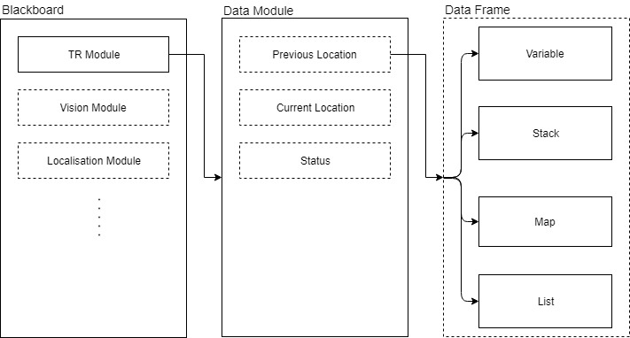

# tr-lang

### Author - Adam Joffe - Joffeadamf@gmail.com
Designed and implemented as part of Undergraduate Engineering Honours Thesis - [Teleo-Reactive Language for Reactive Agent Behaviour](https://github.com/adamjoffe/tr-lang/blob/master/doc/<Adam_Joffe_BEng_Honours_Thesis class="pdf"></Adam_Joffe_BEng_Honours_Thesis>)

## Overview
tr-lang (short for Teleo-Reactive Language) is an interpreted, high-level, dynamically typed, domain specific language (DSL) for short for Reactive Agent Behaviour. Based on the Teleo-Reactive programs concepts as described by [Nils Nilsson](https://www.jair.org/index.php/jair/article/view/10112), the language allows rapid development of complex hierarchical based agent behaviour for real-time robotic platforms.

tr-lang was implemented with an interpreter so that *.tr* source code files can be quickly and easily modified and updated on a remote platform without need to compile. Additionally, to provide improved interoperability with real-time systems that are build on low level C/C++ for performance purposes, tr-lang provides bindings to inject C/C++ functions, variables, objects, methods and lambdas as inbuilt accessable variables and function in tr-lang. This is supported through the tr-lang interpreter existing as a C/C++ object that can be constructed and manage from within an already exists C/C++ pipeline/framework, providing the interface for registering these functions/variables for injects:  

Finally, tr-lang provides a blackboard data structure that can easily be shared between the tr-lang and C/C++ layer allowing for a concurrency safe method of sharing data. For example, platform localisation information computed by C/C++ layer can be provided in the data structure to be used by the tr-lang layer for making behavioural decisions. Example blackboard structure:  

## Language Definition
The language syntax is defined in the [Extended Backus-Naur Form (EBNF)](doc/EBNF.txt)

## Tools

### Profiler

### Drawer

### Debugger

